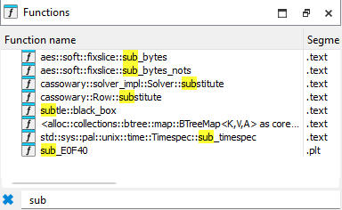
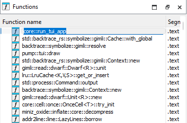

# pumpguardian

> TUI water valve control program where the goal is to input the correct sequence of twelve commands

## Triage

Initial triage reveals that the water valve control program is compiled using Rust:


Using `rustbininfo`, we are able to identify that the TUI used is called `ratatui`:

```bash
Crate(name='ratatui', version='0.26.3')
```

## Methodology

Since the binary is very large, contains framework code and coded in Rust, we have to <u>filter out the noise and reduce the scope of our analysis</u>:

- Is it possible to skip to the get_flag function directly?
- Else, pinpoint how the comparison against the twelve commands is done

Now that we know WHAT we should look for, let's tackle HOW we should do it:

1. Binary was compiled with symbols

   - Evident from the fact that searching for `sub_*` yields no results
   - No need to recover symbols using metadata

   

2. Identify user code in `ratatui` framework

   - Look at GitHub repo -> seems to call a `run()` function

   - Ask AI -> says main loop is usually in `run_app()`

   - <u>Filter by largest function in IDA</u> -> `run_tui_app()`

     

## Analysis

Since `run_tui_app()` is really big, I used MCP to analyze it:

```
scope: pumpguardian folder

overview: This is a Rust TUI app made using ratatui

objective: figure out the correct sequence of twelve commands in order to get the flag

mcp server: analyze binary, rename variables and functions if unnamed, comment
```

```
call    pump::App::get_tag_for_op;  (+0x8dc7e)
...
movzx   r15d, dx // bp AFTER this insn!
```

```
[mappings] -> obtained from pump::App::get_tag_for_op
7391 start 
2748 stop 
1f3e flow 
9122 speed 
eefa manual
```

```
Apparently the commands are two-byte IDs

[heap]:0000555555642090 dw 2748h stop             
[heap]:0000555555642092 dw 7391h start
[heap]:0000555555642094 dw 0EEFAh auto
[heap]:0000555555642096 dw 0EEFAh auto
[heap]:0000555555642098 dw 2748h stop
[heap]:000055555564209A dw 1F3Eh flow
[heap]:000055555564209C dw 9122h speed
[heap]:000055555564209E dw 7391h start
[heap]:00005555556420A0 dw 2748h stop
[heap]:00005555556420A2 dw 1F3Eh flow
[heap]:00005555556420A4 dw 9122h speed
[heap]:00005555556420]A6 dw 7391h start // enter commands from bottom to top, params not impt based on testing
```

```
the AI was kinda inaccurate, so it's important to test & verify byy myself:

Claude analyzed pump::App::get_tag_for_op wrongly:
-> should view args + return value at runtime

Claude identified the comparison at line 1968: if ( *(v352 + 2 * v358) == v356 )
-> Comparison doesn't change no matter what command I entered so it's probably wrong
-> Went to trace backwards from v356 and got the full EXPECTED_COMMANDS_ARRAY
```

I only managed to solve this challenge because of MCP and a bunch of guessing so the writeup is really bad. Not sure if there's a better/proper way to reverse this.

Flag: `ACS{R4taTu1i_Is_a_B2sT!!!}`

---

1. What the GCM decrypt does
2. Where is the comparison of the twelve commands done
3. Where to find expected commands