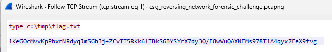
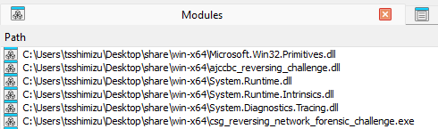
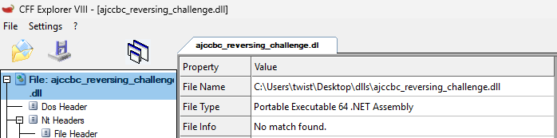
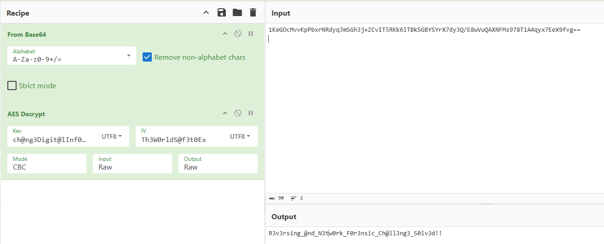

# RE & Network

> You are provided with process memory dump of a backdoor and packet capture data that includes flag value. Try reversing the backdoor to identify flag from the packet capture data.

Following any TCP Stream in the `.pcapng` gives us a base64 encrypted string. Seems like we have to analyze the dump file to figure out how to decrypt it. 



Running `file` on `.DMP` gives us the following:

```
csg_reversing_network_forensic_challenge.dmp: Mini DuMP crash report, 16 streams, Sun Sep  7 06:03:02 2025, 0x421826 type
```

Usually when I get a process dump, I will run strings on it to see if I can find the flag header. However, it did not work for this challenge. So, I did the next most logical step (to me) and threw it into IDA.

Looking at the `Modules` window, it seems that this is a process dump of `csg_reversing_network_forensic_challenge.exe`, which contains a suspicious file `ajccbc_reversing_challenge.dll`.



We can dump the `ajccbc_reversing_challenge.dll` by following the Stack Overflow post [here](https://stackoverflow.com/questions/1643915/how-can-i-extract-dll-file-from-memory-dump)

```
.load clr10\sos.dll
!saveallmodules <dump_dir>
```

Using `CFF Explorer` to triage the file reveals that it is a `.NET` DLL



Hence, we can analyze the code using `DnSpy`

```c#
namespace ajccbc_reversing_challenge
{
	// Token: 0x02000005 RID: 5
	[NullableContext(1)]
	[Nullable(0)]
	public class arc_crypto
	{
		// Token: 0x0600000B RID: 11 RVA: 0x000023B4 File Offset: 0x000005B4
		public arc_crypto()
		{
			string text = "2a5b05310e08081f2b3405031134372a073c1f1c371a2e1c09303b4308393219";
			string text2 = "252e0a0a3a1f291c1b343b39212b3c11013d312f08315158";
			this.key = Encoding.UTF8.GetBytes(arc_crypto.AdvancedDecode(text));
			this.iv = Encoding.UTF8.GetBytes(arc_crypto.AdvancedDecode(text2));
		}
		
   ....
}
```

We can throw this into `ChatGPT` to retrieve the AES Key & IV, then use it to decrypt the base64 encrypted flag in the `.pcapng` as shown

